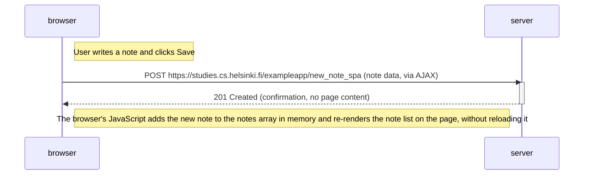

```mermaid
sequenceDiagram
    participant browser
    participant server

    Note right of browser: User writes a note and clicks Save

    browser->>server: POST https://studies.cs.helsinki.fi/exampleapp/new_note_spa (note data, via AJAX)
    activate server
    server-->>browser: 201 Created (confirmation, no page content)
    deactivate server

    Note right of browser: The browser's JavaScript adds the new note to the notes array in memory and re-renders the note list on the page, without reloading it
```
